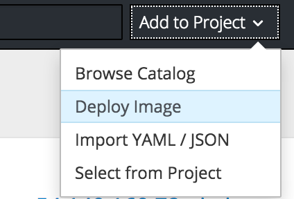
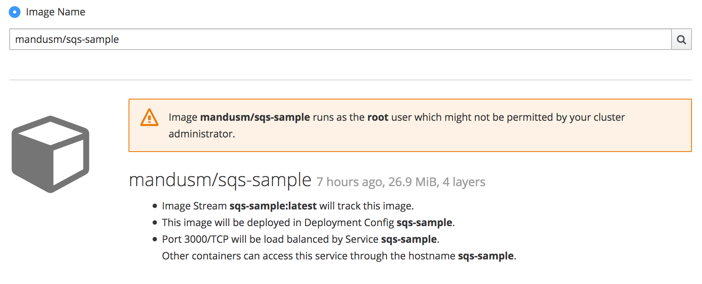
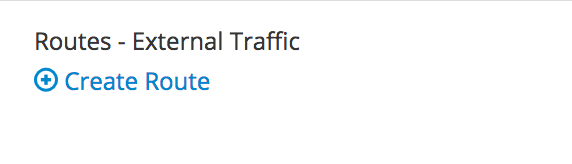

## Introduction
In this lab, we are going to build upon the previous labs and leverage what we have learned to utilize the [AWS Service Broker](https://github.com/awslabs/aws-servicebroker) to provision AWS Services and use them in your OpenShift environment.

Expected completion: 10-20 minutes

## Installation.
The first step is to install the service broker into your cluster environment. Change your directory into the `awssb` directory and run the provided shell script to install the AWS service broker: `deploy_aws_broker.sh`

```bash
cd awssb
./deploy_aws_broker.sh
```

If the installation is successful, you should see a list of new `roles`,`secrets`,`accounts` and `services` created. An expected output would look something like the below snippit.

```bash
service "aws-asb" created
service "aws-asb-etcd" created
serviceaccount "aws-asb" created
clusterrolebinding "aws-asb" created
clusterrole "aws-asb-auth" created
clusterrolebinding "aws-asb-auth-bind" created
clusterrole "access-aws-asb-role" created
persistentvolumeclaim "etcd" created
deploymentconfig "aws-asb" created
deploymentconfig "aws-asb-etcd" created
secret "aws-asb-auth-secret" created
secret "registry-auth-secret" created
secret "etcd-auth-secret" created
secret "broker-etcd-auth-secret" created
configmap "broker-config" created
serviceaccount "awsservicebroker-client" created
clusterrolebinding "awsservicebroker-client" created
secret "awsservicebroker-client" created
route "aws-asb-1338" created
clusterservicebroker "aws-service-broker" created
```

Test the installation...

```bash
oc get clusterservicebroker
```

The expected result will list the AWS Service Broker and the OpenShift Template broker.


If you now log into your cluster through the web console. The Service catalog should show a populated list of AWS Services


## Configure the Service Broker to populate parameters. 
In this section we want to add a secret and some mapping to the AWS Service Broker deployment that will automatically be consumed by the broker, so that we don't need to pass it every time.

First edit the `aws-servicebroker-secret.yaml` and replace `<cfn_role_arn>` with the value of `InstanceProfileArn` that gets returned from running the below command on your EC2 instance

```bash
curl http://169.254.169.254/latest/meta-data/iam/info/
```

Now create a new secret in the `aws-service-broker` namespace

```bash
oc create -f aws-servicebroker-secret.yaml -n aws-service-broker
```

Now we need to edit the AWS Service Broker config map, to add this secret to our service broker. 

```bash
oc edit configmap -n aws-service-broker
```

In the `broker-config: |` section add the below line

```yaml
    secrets:
      - { apb_name: dh-sqs, secret: aws-secret, title: aws-secret}
```

The resulting file should look like this


Now we need to restart the service broker pod in order for the changes to propogate to the OpenShift Service Catalog

```bash
oc rollout latest aws-asb -n aws-service-broker
```

It could take up to 5 minutes for the changes to be registered with the OpenShift Service Catalog.

## Provision a service
Now that we have the service catalog installed and ready to use on the cluster. Let's provision a new SQS queue in a brand new project using the OpenShift console.

### Navigate to the new project. 
Make sure that you are in the new project in the OpenShift Console, by clicking on the project list names in the top left corner, and selecting the new project you created when provisioning the SQS queue.


### Deploy a new image. 
In the right hand side of the console, click on "Add to Project" and in the dropdown select "Deploy an Image"


### Type in the Image Name and Deploy
In the pop-up that gets displayed, enter the image name you want to deploy `mandusm/sqs-sample`. Click the magnifying glass icon to load the metadata from the Docker Repository. 


### Deploy the image. 
Now deploy the image by clicking on the `Deploy` button. 

### Create route. 
Now that the application has been provisioned, we need to expose a route for it in order to open it in our browsers. In the console, click the downward facing arrow next to the application pod to expand the pod details. Find the `expose route` link. Click on it, leave everything in the new form as default, and click `create`


Once this is done, you should see a new URl available above your pod. Click on this URL to open your app in a new browser tab. You can expect to see an error of missing credentials / parameters. 

### Create Binding. 
Earlier we created the SQS Service. Navigate back to the service in the console and look for the `Create Binding` hyperlink. Click it and follow the pop-up wizard. Leave everything default. 

Now that the secret has been created, attach it to your application. Click on `view secret`, then on `add to application` in the top right. Select the application you launched earlier from the drop down. Leave the secrets as environment variables and click save. 

Your pods should now automatically restart.

### Verify
Go back to the sample webpage that gave you errors earlier and refresh the page. You should now see the app returning request IDs


